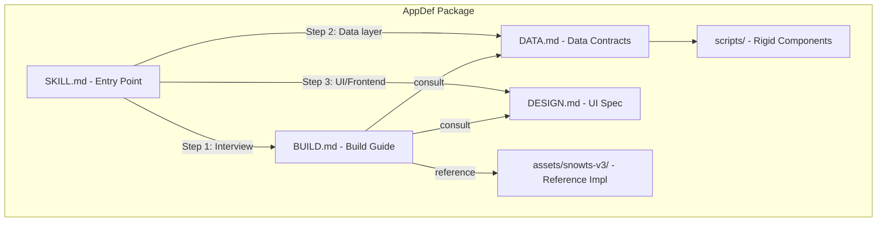

# Plan: SnowTS AppDef Package

## Concept

The "appdef" is a new application packaging paradigm: instead of sharing full source code, you share a set of markdown specifications and critical scripts. A receiving user's coding agent reconstructs the application to their own style and tech stack.

Every application has two sides:
- **Deterministic**: Data schema, DDL, Snowflake objects, data contracts, stored procedures, agent specs -- these must be reproduced exactly for interoperability.
- **Probabilistic**: UI design, layout, component architecture, workflow organization, personalization -- these are guided by specs but reconstructed by the agent to fit the user's preferences and tech stack.

The appdef itself is structured as a **Cortex Code skill**, so loading it teaches the agent how to build the app.

## Architecture



## Directory Structure

```
snowts-v3-appdef/
├── SKILL.md                          # Skill entry point + workflow router
├── DATA.md                           # Rigid data contract specification
├── DESIGN.md                         # UI design philosophy + patterns
├── BUILD.md                          # End-to-end build + personalization guide
├── scripts/
│   ├── ddl.sql                       # All table DDL (parameterized with {{DB}} / {{WH}})
│   ├── search_services.sql           # Cortex Search service definitions
│   ├── semantic_view.yaml            # Semantic view YAML (exact spec)
│   ├── agent_spec.yaml               # Cortex Agent YAML specification
│   └── stored_procedures.sql         # Stored procedure code (ANNOTATE_WIKI_ARTICLE)
└── assets/
    └── snowts-v3/                    # Full reference implementation (read-only)
```

---

## File-by-File Design

### 1. SKILL.md (Entry Point)

**Purpose**: The outermost skill that a Cortex Code agent loads. It teaches the agent what this appdef is, how to use it, and routes to the correct workflow step.

**Key sections**:
- **Frontmatter**: name `snowts-appdef`, description with triggers like "build snowts", "knowledge management app", "personal wiki"
- **What is an AppDef?**: Brief explanation of the deterministic/probabilistic split
- **Workflow**: 5-step process:
  1. **User Interview** (from BUILD.md) - Understand the user's workflow, note-taking style, tech preferences
  2. **Data Layer Setup** (from DATA.md + scripts/) - Create Snowflake objects exactly per spec
  3. **Backend Construction** (from BUILD.md) - Build API layer guided by DATA.md contracts
  4. **Frontend Construction** (from DESIGN.md + BUILD.md) - Build UI guided by design philosophy
  5. **Validation** - Verify all data contracts are met, UI matches design intent
- **Stopping Points**: After interview, after data layer, after full build
- **References**: Points to DATA.md, DESIGN.md, BUILD.md, scripts/

**Degrees of freedom**: High for this file (it's routing logic).

### 2. DATA.md (Rigid Data Contracts)

**Purpose**: The most critical file. Defines everything about the data layer that must be reproduced exactly for any instance of this app to interoperate.

**Key sections**:

- **Database Architecture**: Configurable DB name (`{{DB}}`), fixed `APP` schema, configurable warehouse (`{{WH}}`)
- **Table Definitions**: All 13 tables with exact column names, types, and descriptions. Presented as a reference table format, with full DDL in `scripts/ddl.sql`.
- **Relationships**: Entity-relationship summary (TODOS -> CLIENTS via CLIENT_ID, ARTICLE_CONTENT -> ARTICLES via ARTICLE_ID, etc.)
- **Stages**: `RAW_DOCS` internal stage with DIRECTORY enabled
- **Cortex Search Services**: Two services with their exact column projections and filter predicates
- **Semantic View**: Points to `scripts/semantic_view.yaml` for exact YAML
- **Cortex Agent**: Points to `scripts/agent_spec.yaml` for exact YAML, documents the 5 tool types
- **Stored Procedures**: ANNOTATE_WIKI_ARTICLE with its contract (inputs, outputs, behavior)
- **Local Folder Structure**: `notes/`, `raw/`, `wiki/` directories and their purpose
- **Data Portability**: How data can be migrated between instances (MERGE-based migration using MERGE_KEYS)
- **Extension Points**: Where users CAN add flexibility (VARIANT columns in RAW_DOCS_STAGING, additional tables in APP schema, custom stages)

**Degrees of freedom**: LOW. This is the rigid backbone. The DDL and object definitions must be exact.

### 3. DESIGN.md (UI Philosophy + Patterns)

**Purpose**: Captures the visual and interaction design of SnowTS in a way that an agent can recreate in any framework.

**Key sections**:

- **Design Philosophy**: Dark-mode-first, information-dense, keyboard-centric, progressive disclosure. Not prescriptive CSS but guiding principles.
- **Layout Architecture**: The shell pattern - sidebar navigation, main content area, sliding agent panel, quick input bar, activity toolbar. Described as spatial relationships (widths, positions) not implementation.
- **Color System**: Semantic color roles (background, surface, border, primary, text, status colors) with reference values. The agent can adapt to match the user's preferred palette.
- **Component Catalog**: Key UI patterns needed:
  - Navigation: sidebar with route links
  - Agent Panel: sliding chat with streaming, tool use display
  - Quick Input: unified input bar (text, URL, file)
  - Command Palette: keyboard shortcut search/navigation
  - Data views: tables, cards, lists for articles/clients/todos
  - Markdown editor/viewer for notes and wiki
  - Activity feed: real-time event stream
- **Page Patterns**: Dashboard (KPIs + recent items), List page (filter + grid), Detail page (entity + related items), Editor page (markdown + metadata)
- **Interaction Patterns**: Keyboard shortcuts, streaming responses, optimistic updates, offline queue indicator

**Degrees of freedom**: HIGH. This is the probabilistic side. The agent should use these as guidelines but is free to adapt to the user's style and framework choice.

### 4. BUILD.md (Build + Personalization Guide)

**Purpose**: The step-by-step guide for an agent to construct a full working instance of this application, starting with an interview to understand the user's workflow.

**Key sections**:

- **Application Purpose**: Personal knowledge management - ingest documents, process with AI, organize into wiki, track clients/todos, query with AI agent.
- **Application Pattern**: Ingest -> Process -> Organize -> Query -> Act
- **User Interview Script**: Agent-driven onboarding questions:
  1. How do you take notes today? (freeform, structured, audio, etc.)
  2. How do you organize knowledge? (folders, tags, links, categories)
  3. What does your todo/task workflow look like? (GTD, kanban, priority-based)
  4. What entities do you track? (clients, projects, people, topics)
  5. What's your preferred tech stack? (React, Vue, Svelte, CLI-only, etc.)
  6. Do you want a local-first or cloud-first experience?
  The agent uses answers to customize the probabilistic side.
- **Build Steps** (two tracks):
  - **Snowflake-Accelerated Track**: Uses scripts/ directly, creates all objects via `scripts/ddl.sql`, `scripts/agent_spec.yaml`, etc. Fast, exact.
  - **General Platform Track**: Translates DATA.md contracts to the user's chosen database, adapts Cortex-specific features to alternatives or stubs them.
- **Backend Construction**: API route map (from [SPEC.md](~/code/snowts-v3/SPEC.md)), data access patterns, AI pipeline stages
- **Frontend Construction**: References DESIGN.md, adapts to user's framework choice
- **Personalization Guide**: How to customize based on interview answers (e.g., if user prefers Zettelkasten, emphasize bidirectional links; if GTD, add contexts/areas to todos)
- **Validation Checklist**: Data contracts met, all Snowflake objects exist, pipeline processes files end-to-end, agent responds to queries

**Degrees of freedom**: MEDIUM. The build sequence and data layer are rigid; the personalization is high freedom.

### 5. scripts/ (Critical Rigid Components)

These are extracted from [setup.py](~/code/snowts-v3/app/backend/services/setup.py) and parameterized with `{{DB}}` and `{{WH}}` placeholders.

| File | Source | Purpose |
|---|---|---|
| `ddl.sql` | TABLE_DDL dict from setup.py | All 13 CREATE TABLE statements + stage |
| `search_services.sql` | SEARCH_SERVICE_DDL + WIKI_SEARCH_SERVICE_DDL | Both Cortex Search service definitions |
| `semantic_view.yaml` | SEMANTIC_VIEW_YAML string | Exact semantic view YAML for SYSTEM$CREATE_SEMANTIC_VIEW_FROM_YAML |
| `agent_spec.yaml` | AGENT_DDL inner YAML | Cortex Agent specification (models, tools, instructions) |
| `stored_procedures.sql` | ANNOTATE_PROCEDURE_DDL | ANNOTATE_WIKI_ARTICLE procedure |

All scripts use `{{DB}}` and `{{WH}}` as placeholders that the build process substitutes.

### 6. assets/snowts-v3/ (Reference Implementation)

A read-only copy of the full `~/code/snowts-v3` source tree. This is NOT meant to be deployed directly -- it serves as a reference the agent can consult when reconstructing components. The agent reads patterns from it but writes new code in the user's preferred style.

---

## Key Design Decisions

1. **Placeholder syntax**: `{{DB}}` and `{{WH}}` in scripts (SQL-safe, easy to find-replace)
2. **Two build tracks**: Snowflake-accelerated (uses scripts directly) vs. general platform (translates to user's DB)
3. **Interview-first**: BUILD.md starts with understanding the user before building anything
4. **DESIGN.md is advisory**: The agent should use it as inspiration, not as a CSS file to copy
5. **DATA.md is authoritative**: Any deviation from the data contracts breaks interoperability
6. **Full reference in assets/**: Reduces ambiguity -- the agent can always consult a working example

## Validation

After implementation, verify:
- [ ] `SKILL.md` is under 500 lines, has proper frontmatter and triggers
- [ ] `DATA.md` contains all 13 table definitions, all Snowflake objects, and migration contracts
- [ ] `DESIGN.md` captures layout, colors, components, and interaction patterns
- [ ] `BUILD.md` includes interview script, both build tracks, and validation checklist
- [ ] `scripts/` contains all 5 files with `{{DB}}`/`{{WH}}` parameterization
- [ ] `assets/snowts-v3/` is a complete copy of the reference implementation
- [ ] CYOA analysis: every path in SKILL.md reaches a halting state
